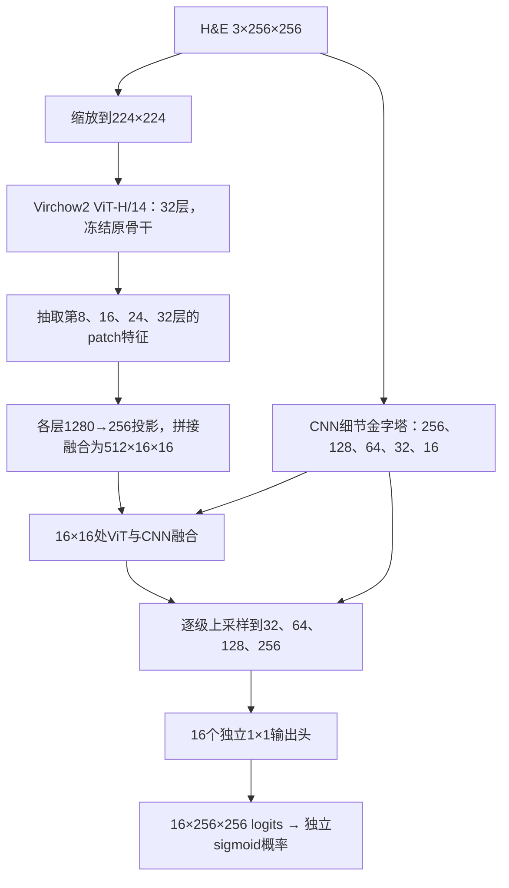

# 当前项目全流程：数据、架构、loss与训练步骤

本文以正在运行的 `runs/ddp_positive_dice` 的实际配置和代码为准，记录于2026-09-29。旧文档中41病例、29/6/6划分、所有有效图像都算Dice等描述属于此前版本，不代表当前实验。本文为说明文档，不改变训练。

## 1. 任务定义与版本位置

输入一张配准的H&E组织patch，输出16通道逐像素marker表达概率。任务是**多标签二分类的集合**：同一像素可以同时表达多个marker，独立sigmoid输出之和不要求为1。它既不是原始mIF强度回归，也不是互斥细胞类型分类。

保留的16通道为Hoechst、CD31、CD45、CD68、CD4、FOXP3、CD8a、CD45RO、CD20、PDL1、CD3e、CD163、ECadherin、Ki67、Pan-CK、SMA。源文件17通道时排除PD-1。

- `vit_versions/vit_v1`、`vit_v2`、`vit_v3`：历史强度回归模型及其结果。
- `runs/ddp_baseline`：已完成的第一版分类基线。
- `runs/ddp_positive_dice`：当前运行，修正CRC33患者身份隔离，采用阳性图像/通道Dice；从Virchow2预训练权重及新适配器/解码器开始训练。
- `experiments/pixel_balance`：仅准备和检查的新采样/权重候选，尚未训练。

## 2. 数据来源、质控和患者划分

使用MIPHEI发布的ORIONCRC配准H&E/mIF patch数据，保留318450张源patch。当前复用发布数据的质控结果，没有重新跑StarDist，也没有重新按DAPI Dice筛掉patch。

核一致性属于可选质控信息，不是其他通道共同的淘汰门槛。当前没有新增核质控金标分组；DAPI阴性但其他通道阳性的patch保留，也不用DAPI核区域截断细胞质或胞外信号。

先锁定患者划分，再拟合训练集统计量。固定seed=42，train/val/test按患者约70%/15%/15%；CRC33_01与CRC33_02属于同一患者，均放入test，避免跨切片患者泄漏。

|集合|患者数|自然patch数|用途|
|---|---:|---:|---|
|train|28|223400|梯度更新、拟合数据统计和权重|
|val|6|56832|每轮验证、早停、固定best后的阈值选择|
|test|6|38218|模型与阈值确定后的独立评估|

当前固定集合不再重新打乱患者归属；训练时只打乱抽样条目顺序。验证与测试保持自然分布，不使用平衡子清单作为主评价集。

## 3. 通道可用性、像素标签与背景

检查文件、H&E/mIF配对、通道结构和切片级通道信号。通道完整且该切片至少观察到过信号，才视为可用于监督；整切片全零或缺失的通道标为未知，不自动当可信阴性。这个规则是数据可用性判断，不等同于证明染色失败或生物学缺失。

当前标签定义：处理后的mIF强度>0为1，等于0为0。它是可复现的表达标签定义，极弱非零不一定是病理学确认阳性。

背景处理分两层：

1. 根据H&E颜色、亮度识别空白玻片，输入图像在归一化前后都将玻片背景设为0。
2. 训练和评价时，所有有效通道都为0的组织像素设为ignore=255；未知通道也ignore。某通道为0、其他有效通道为1的像素仍是有效负例。

推理时只有H&E可用，因此只用H&E组织掩膜把背景输出置零，不借用GT阳性区域遮住预测。网络仍是稠密计算，不能说背景坐标完全不经过卷积/注意力；准确表述是背景无监督贡献，输出时按H&E背景掩膜排除。

训练集拟合各通道阳性强度均值、标准差、99.9%分位数q和阳性patch覆盖率均值。q用于强度尺度/展示等，不把当前二值表达标签改成强度回归目标。

## 4. 当前训练采样与候选采样的区别

当前在原始patch组织区域统计通道阳性覆盖率：

- true：该通道有阳性像素。
- true1：覆盖率高于train中该通道true patch的平均覆盖率。
- true2：覆盖率大于0且不高于该平均值。
- false：通道可用、该patch该通道无阳性、H&E组织可用。

每个通道专属清单不放回抽取 **false:true1:true2=2:1:1**，再合并可行通道清单，保留同一patch来自不同通道的重复记录。每条记录训练时仍监督全部有效通道。

当前合并训练清单723136行，覆盖215170张不同patch；一个patch可能出现多次，实际最大16次。四卡每卡batch64，末尾不完整batch丢弃，因此每轮实际722944条、2824次更新。每轮通过DistributedSampler重新打乱清单，增强种子随epoch与清单位置变化。

2:1:1保证通道专属子清单的比例，不能声称合并后每个通道的边际比例都严格一致。按256网格重新统计、false:true1:true2=4:1:1、自然覆盖全部训练patch、重复上限4次，是候选方案，当前未启用。

## 5. 缓存、输入预处理与增强

原数据预先构建本地原生分辨率缓存，复用H&E、打包标签和组织掩膜，减少训练中重复读取/解码TIFF的开销。保持真实原生几何，不按文件名中的512推断图像尺寸。

训练读取缓存后，先做同步增强，再缩放到256×256。H&E使用ImageNet均值/标准差归一化；标签和掩膜使用最近邻插值，避免产生混合类别。

只在train增强：

- 随机0/90/180/270°旋转、50%概率水平翻转。
- 35%概率小角度旋转±10°和缩放0.95～1.05。
- 50%概率H&E对比度±5%、亮度±5/255、RGB各通道增益±3%。
- 几何变换同步应用于H&E、标签和mask；颜色变化只作用于H&E。

验证和测试没有随机增强。未启用强弹性变形、CutMix或GT通道颜色增强。

## 6. 当前模型架构

### ViT与LoRA

Virchow2 ViT-H/14，32个Transformer block，隐藏维度1280，16个attention head。224输入得到16×16 patch网格。抽取空间特征时去掉1个CLS和4个register token。

32层attention的Q、V均注入LoRA；rank=32、alpha=16，更新缩放alpha/r=0.5，约524万LoRA参数。K、attention原权重和MLP没有单独微调，骨干原参数冻结。LoRA的A随机初始化、B零初始化。

抽取第8/16/24/32层，各自为1280×16×16；分别1×1投影到256通道，拼接为1024通道，再融合到512通道。这四层空间分辨率相同，属于不同深度的语义融合，不是四个不同分辨率的ViT金字塔。

### CNN分支与decoder

CNN提供以下细节特征：

|特征|空间大小|原始通道数|
|---|---|---:|
|s1|256×256|32|
|s2|128×128|64|
|s4|64×64|128|
|s8|32×32|128|
|s16|16×16|64|

前两级使用并行膨胀卷积；其余级使用卷积、BatchNorm、ReLU与池化。CNN、融合neck、decoder及输出头均训练，BatchNorm使用四卡SyncBatchNorm。

decoder在16×16处融合512通道ViT特征与投影后的CNN s16特征，然后依次双线性上采样，并拼接CNN的s8/s4/s2/s1跳连。各阶段输出通道依次512、256、128、64、64，最后16个独立1×1卷积头各输出一个marker的logit。

当前分类构建器明确选择logits，不使用旧回归模型的Tanh。现有结构已含CNN多尺度跳连，但没有在每个ViT block内部与CNN双向融合；逐层融合、门控融合和核/细胞质/胞外先验只保留分析蓝图，尚未启用。

## 7. 当前loss设计

记p为sigmoid概率、y为0/1标签、V为有效监督掩膜。每个通道分别计算：

**像素MSE：**

`MSE_c = Σ(V × (p−y)²) / ΣV`

对batch和空间中的有效像素求平均，正负像素同权，没有额外阳性倍数。

**阳性图像/通道Dice：**

`DiceLoss_bc = 1 − (2Σ_HW(Vpy)+ε)/(Σ_HW(Vp)+Σ_HW(Vy)+ε)`

只在含该通道GT阳性的图像/通道对上计算，再按通道对这些图像取平均。空间H/W参与求和，16通道不混在一起展平。阳性图像内部的有效阴性像素仍进入分母，假阳性仍受罚；完全阴性的图像/通道不算Dice，只由MSE约束。

**通道权重：**

σ_c来自训练集该通道阳性像素的强度标准差；先除255，再取`1/max(σ_c,0.001)`，均值归一化、裁剪到[0.25,4]、再次归一化，得到γ_c。目前实际约0.862～1.103。

`L = Σ_c γ_c × (1.0 × MSE_c + 1.0 × DiceLoss_c) / Σ_c γ_c`

无有效像素的通道不计入这一批的通道加权平均。γ同时影响MSE与Dice，既不是正负像素比例权重，也不是阳性patch数量倒数。

四卡先汇总有效分子和分母，再计算全局loss，并补偿DDP默认梯度均值。各卡有效像素数不同、某通道缺失或某卡全ignore时，不应错误稀释有效监督。当前梯度累积为1。

当前没有启用：额外正像素加权、样本数量权重、患者权重、Lovasz-Hinge或Dice系数0.5。

## 8. 优化器、调度与停止条件

|设置|当前实际值|
|---|---|
|分布式|4卡DDP|
|每卡batch|64|
|全局batch|256|
|梯度累积|1|
|计算精度|BF16混合精度；loss使用float32|
|优化器|AdamW，betas=(0.9,0.999)，eps=1e-8|
|LoRA基础学习率|1e-4|
|CNN/neck/decoder/输出头基础学习率|3e-4|
|weight decay|0.01；bias及一维参数不衰减|
|warmup|前2轮线性预热|
|后续学习率|按更新步数余弦下降，最低为初始值5%|
|梯度裁剪|范数1.0|
|最大epoch|40|
|早停依据|验证macro-IoU，阈值固定0.5|
|patience / min_delta|8 / 0.001|
|早停保护期|前10轮不累计坏轮数|
|DataLoader|每卡4 workers，prefetch_factor=2|

best.pt保存任何更高的验证macro-IoU；patience的显著改善条件另使用min_delta=0.001。因此best选择与早停计数不是完全相同的比较规则。当前不是以最小valloss选择best。

batch64已做真实四卡缓存输入验证；容量校验保留显存余量，不以显存占用100%为目标。当前每轮训练约47分钟、验证约1.6～1.8分钟，完整轮次约49分钟；不是剩余训练总时长承诺。

## 9. 每轮训练与完整执行顺序

完整流程：患者划分与通道检查 → train统计/清单 → 数据验证 → 原生缓存 → 四卡容量检查 → DDP训练 → 固定best → 验证集阈值选择 → 测试集评价 → 图表与预测导出。当前数据和缓存已完成，正在DDP训练阶段。

每轮训练：

1. 保持患者集合不变，DistributedSampler按epoch打乱训练清单、分配四卡条目。
2. 从缓存读取patch，执行轻度在线增强、标签掩膜同步变换和归一化。
3. 前向得到16通道logits，sigmoid后计算全局MSE与阳性Dice。
4. 反向传播，仅更新LoRA、CNN、neck、decoder和输出头；裁剪梯度、更新学习率及AdamW。
5. 全量自然验证集前向，不做随机增强；各patch恰好评价一次，不补齐、不重复、不丢弃。
6. 记录train/val总loss、MSE、Dice、分类指标、学习率、各阶段耗时；输出一个固定验证patch快照及概率数据。
7. 保存last.pt；macro-IoU更高则保存best.pt；同步各卡早停状态。

checkpoint同时保存模型、优化器、配置、数据签名、历史和各卡随机状态。恢复时检查代码/配置/数据一致性，避免把不同目标函数或不同划分的实验直接拼接。

## 10. 阈值、指标与可视化

训练期间固定0.5阈值用于模型选择，避免每轮调阈值掩盖变化。训练结束固定best后，只在自然val上逐通道搜索0.05～0.95范围内的F1阈值（256-bin网格）；正负像素各至少100，且分别有至少2名患者支持，否则回退0.5。并列最优优先离0.5最近的阈值。

这是决策阈值选择，不是概率校准变换。test同时报告固定0.5与验证选定阈值的结果。此前留一患者阈值检查是旧baseline的小样本诊断，没有把其阈值写入当前训练。

主要指标：逐通道Precision、Recall、F1/Dice、IoU、Specificity、混淆矩阵，以及macro/micro汇总；另外记录直方图近似AUROC/AP、Brier/ECE等。没有使用PSNR或SSIM。

可视化有三种用途：

- 每epoch固定验证patch快照，用于观察训练过程。
- argmax主导通道配色，仅作展示，不替换多标签监督和指标。
- 复用v1/v2/v3原多色荧光叠加方法的24张同patch对照，每历史测试切片4张。历史方法只显示固定10个marker；分类概率的亮度不能当回归强度解读，另提供GT二值标签/概率无增益对照。

历史四版本统一定量比较只使用共同未训练的CRC02；其余历史可视化患者存在旧模型训练暴露，仅供定性查看，不能据此作独立泛化排名。

## 11. 当前进度与待验证内容

截至本次读取，已完成2轮，第3轮进行中。前两轮结果：

|轮次|trainloss|valloss|val MSE|val Dice loss|val macro-F1|val macro-IoU|
|---|---:|---:|---:|---:|---:|---:|
|1|0.84095|0.76809|0.08624|0.68185|0.56698|0.43272|
|2|0.72857|0.74884|0.08846|0.66038|0.57524|0.44019|

总验证loss与分类指标在改善，但验证MSE略升，不能只看总loss判断所有通道都变好。仅两轮不足以认定过拟合或确定新权重会更好。

尚未启用：4:1:1候选采样、自然覆盖/重复上限4、通道权重统一为1、按像素比例的温和正样本权重、Dice=0.5、患者或false/true1/true2样本数加权、逐层ViT-CNN融合、StarDist先验。它们与当前训练保持隔离。

## 12. 文件索引

- 当前实际配置：`runs/ddp_positive_dice/results/model/config.json`
- 数据划分/统计/检查：`runs/ddp_positive_dice/data/`
- 训练日志、模型、逐轮指标、快照：`runs/ddp_positive_dice/results/model/`
- 入口与流程：`scripts/run.sh`、`vit_seg/workflow.py`
- 数据与增强：`vit_seg/prepare.py`、`vit_seg/data.py`、`vit_seg/cache.py`
- 架构与LoRA审计：`vit_seg/model.py`、`vit_matte/vitmatte_unet.py`、`vit_matte/encoder.py`、`vit_matte/lora.py`
- loss与四卡归一化：`vit_seg/distributed.py`
- 训练/评估：`vit_seg/train_ddp.py`、`vit_seg/metrics.py`、`vit_seg/thresholds.py`
- 最新loss与样本加权分析：`review/loss_sample_weighting_20260929/分析报告.md`
- 旧版风格可视化：`review/unified_eval_20260929/legacy_style/index.html`
- 未启动候选方案：`experiments/pixel_balance/README.md`
