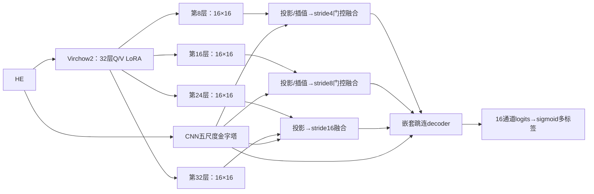

# 分类任务、融合解码器、损失与核先验的分析

> 最新执行决定：直接复用MIPHEI已质控patch，不再清洗或运行StarDist。下文第2节保留为早期核质控方案分析，不在当前主流程执行。全量保留318450张，仅进行通道统计、患者划分、平衡采样、在线增强及多标签分类。切片级全零通道记为可用性未知，不是已经证实缺失；原数据始终保留。

## 1. 从强度回归改为像素分类的含义

用户已确认采用**逐像素多标签分类**：每个通道独立输出sigmoid概率，同一像素可同时属于多个通道；16通道概率不要求和为1。监督为16维multi-hot二值标签，保留共表达。默认0.5阈值生成16通道二值预测，阈值可以只在val上校准。

argmax只生成便于浏览的主导通道示意图，不用于loss、主评价或替代多标签输出。若全部通道低于阈值，展示为0；概率NPZ与16通道标签TIFF保留完整结果。这是marker表达分类，不等于细胞类型分类。

背景必须区分：空白玻片、组织内所有marker为零、某一个通道阴性。空白玻片可从HE识别并屏蔽；GT全零可以在训练和评估时忽略；某通道阴性但其他通道阳性的组织像素必须保留，它是分类的有效负例。否则false集没有训练意义。

推理不能借用GT全零mask；当前只使用HE组织mask。组织内没有marker的区域允许所有通道均低于阈值，但训练中忽略全零区域后，这种拒识能力仍需验证，不能保证完全排除。要进一步排除这些区域，可加独立HE前景预测分支，在val校准；不能拿test的mIF来遮罩预测。背景置0和loss/指标排除已经实现，但常规稠密卷积仍会在这些位置执行运算，并不等于跳过所有背景算子。
## 2. StarDist核质控：诊断配准/结构一致性，不淘汰其他通道

使用官方 `2D_versatile_he`，输入RGB HE；它与荧光用模型不同。当前沿用官方预训练阈值，输入做1/99.8百分位RGB联合归一化，二值核并集用于Dice。批量推理与官方逐图调用核对；GPU上发现像素级差异后自动回退官方逐图推理，不放宽掩膜一致性条件。[StarDist官方实现](https://github.com/stardist/stardist)

可评价时仍记录原阈值等级：Dice<0.2为核质控失败，0.2～0.6普通一致，>0.6高一致，恰好0.2/0.6属于普通一致。等级不再删除patch；DAPI全零、核过少或参考不可用时标为`not_evaluable`并进入复核清单。高一致也只代表核结构一致，不能推导出16个marker都可靠。

原生tile实测为333×333；文件名中的512是原始坐标窗口，不应直接当成像素尺寸。核质控在实际HE/IF共同网格上完成。另记录DAPI>5敏感性Dice。旧82张预览中两种参考有6张等级不同；这些数字只保留为诊断证据。已有nuclei为DAPI Cellpose后扩张2μm的细胞区域代理，本地元数据标为cell，与StarDist纯核存在定义不一致。

DAPI阴性但其他通道阳性的patch保留，DAPI不遮罩其他marker。通道有效性独立处理：同一切片该通道确实出现过信号时，当前零信号patch才进入false候选；切片级全零通道标为不可用并从该通道loss/指标排除。详见 `GT来源与筛选偏差.md` 和 `MIPHEI可借鉴方案.md`。

## 3. LoRA：32层已经全部覆盖

检查真实Virchow2模型及GPU反向后确认：32个attention block的Q/V都装有LoRA，rank32、alpha16，总计5.243M可训练参数。不是只在8/16/24/32四个取特征层装LoRA；那四个编号只是输出特征的取样点。

目前K投影和MLP没有LoRA。“每层再配一个”会重复现有功能。可做的消融是仅末8/16层Q/V、全部32层Q/V，以及全部Q/K/V；给K增加LoRA约再增加2.621M参数，但不能保证更好。数据规模和标签噪声相同情况下，应优先比较验证macro-IoU、稀疏类召回、显存和过拟合，不直接扩大适配范围。

## 4. 当前decoder的做法

1. HE一支resize为224送入Virchow2，在8/16/24/32层取1280通道特征，空间网格都为16×16。
2. 每层用1×1投影到256通道，拼接后融合为512通道；这些层语义深度不同，但没有天然不同的空间尺度。
3. CNN DetailCapture从HE生成stride1/2/4/8/16特征；浅两层用多尺度膨胀卷积。
4. ViT融合结果与CNN stride16特征拼接，经过conv16，然后逐级双线性上采样，与CNN对应层拼接，恢复全分辨率。
5. 原16个1×1头继续输出16通道，现在返回logits，去掉回归Tanh，通过sigmoid形成各通道独立概率。

优点是结构清楚、CNN保留边缘细节、ViT提供语义。局限是ViT只在最深处融合一次，浅层decoder难以直接使用早期ViT特征；conv16的三个512通道大卷积分支成本较高；BatchNorm在小batch下也可能不稳定。后续可比较GroupNorm或较小投影通道，但本次没有把这些变化和分类任务一起混入主模型，以免无法解释增益来源。

## 5. GigaTIME式跳连与ViT/CNN融合蓝图（未接入主模型）

检查本地 `/home/weiyh/GigaTIME_run/GigaTIME/scripts/archs.py`：GigaTIME采用UNet++样式的五尺度CNN和嵌套密集跳连，最终1×1输出；并不是32层ViT分别与CNN逐层融合。[GigaTIME官方代码](https://github.com/prov-gigatime/GigaTIME)、[UNet++作者论文](https://arxiv.org/abs/1912.05074)

推荐先做四阶段融合，再比较更密集的连接：

模块接口和通道数已写入 `fusion_blueprint.json`，状态是 `design_only_not_connected_to_training`。采用投影、分支归一化、零初始化残差门控，允许从当前baseline平滑开始；深监督仅用于训练。当前任务只搭架构方案，没有实现或启用新增融合分支。

为何不直接32层全接：这些层空间网格一样，相邻层可能高度冗余；保留32组激活会增加显存，插值也不会创造新细节。四阶段→八阶段→三十二阶段逐步消融，才能判断增加连接是否真的带来稀疏marker召回和边界改善。效果更好是待验证的假设，不是架构越复杂就必然更准。

## 6. loss选择：先MSE＋逐通道Dice，Lovasz-Hinge作为对照

概率MSE是对multi-hot二值目标的Brier类误差，不是继续回归mIF强度。当前loss为：

`L = sum_c w_c * (lambda_mse * MSE_c + lambda_overlap * DiceLoss_c) / sum_c w_c`

MSE仅统计有效像素；Dice先在每张图每个通道的H/W维计算，再平均，不把C与H/W一起展平。背景mask同时作用于分子分母，整张全背景时返回可反传的0，背景像素梯度经测试为0。

| 项目 | 逐通道Dice | 逐通道Lovasz-Hinge |
|---|---|---|
| 主要优化目标 | 区域重叠/F1 | IoU代理目标 |
| 计算 | 空间求和，较便宜 | 每类有效像素排序，较贵 |
| 稀疏类 | 有用，但空类策略须明确 | 可对齐IoU，空类和小样本仍须处理 |
| 本次使用方式 | 默认首个基线 | 配置可切换的消融 |

Lovasz-Hinge面向二分类带符号logits，与本次各通道独立二分类相容。它直接用原始logits，MSE使用sigmoid概率；不应先sigmoid再送入Hinge。实现按通道独立排序有效像素，不把不同通道混在一个排序向量里。Dice保留每图每通道H/W聚合，作为首个基线；Hinge更直接针对IoU但计算更贵，是否更好需对照实验。[作者代码](https://github.com/bermanmaxim/LovaszSoftmax)、[原论文](https://openaccess.thecvf.com/content_cvpr_2018/papers/Berman_The_LovaSz-Softmax_Loss_CVPR_2018_paper.pdf)

1/σ来自train保留true集阳性强度像素，随后归一化、限制极端权重、再归一化。它不等同于类别频率的倒数，而且我们已经平衡采样，不能再无约束叠加极高的稀疏类权重。当前1:1系数及[0.25,4]初始限制只作消融起点，建议比较MSE:Dice=1:0.5、1:1、0.5:1，并观察每类梯度、ECE、少数类precision/recall。系数只能在train/val上选择，test不用于调权。

## 7. 核、核周与细胞外先验

StarDist给出核实例，不能单靠它精确分割细胞质。核外固定半径扩张只是“核周区域代理”，不是可靠的细胞膜边界。可先构建核概率、距核距离、核周环带三个软特征，使用小门控侧支，和无先验模型做消融。

推理和训练都必须从HE跑StarDist；GT DAPI仅用于清洗/监督，不能当推理输入。分类先验可对Hoechst/FOXP3/Ki67等核相关marker有帮助，但膜marker和SMA等结构性表达不宜被强制限定到核内。细胞外组织也不等于空白背景，强制清零会损失基质相关信息。

推荐顺序：无先验baseline → HE核概率/距离软先验 → 核周代理 → 如确有细胞边界标签，再比较真正核/胞质/胞外三分区。先验是否提升准确率必须由独立val/test判断，本次只完成接口蓝图和分析，未把预测核当作完美GT。

## 8. 检查和清理边界

历史v1缺失的vit_proj和普通conv16已恢复；三个版本共享同一已修复代码，配置和选用权重各自独立。修复了验证计数、best/早停耦合、旧checkpoint最佳基准恢复、缺预测静默评估、可视化stem、缺q静默回退、缓存来源和GPU任务争用等审查问题。

删除范围限定在 `vit_versions` 的旧日志、失效等待启动脚本、未选中快照软链、过程预览、重复源码。没有跟随软链删除外部真实权重，也没有删除原始patch或其他CNN/扩散项目代码。历史最终结果留作比较，删除清单保存在 `cleanup_manifest.json`。

修复并不意味着所有运行场景已经被穷尽验证。GPU合成单批前后向通过不能证明分类准确率提升；完整清洗结果与实际训练结果分别以完成标记、统计JSON和验证指标为准，不能把冒烟子集数字冒充全量。

## 9. 病例划分与采样

用户确认：重新按患者70%/15%/15%分组，种子42；41个ORION病例采用最大余数取整，train/val/test为29/6/6例。清洗前patch为226465/56832/35153，患者比例不会保证patch比例相同。先锁定患者分组，再计算train统计，val/test绝不参与阈值或权重拟合。ORION病例ID是当前数据提供的分组标识；不能用随机patch划分代替病例划分。

各通道分别生成false:true1:true2=2:1:1的不放回平衡清单；组为空时标记无法平衡，不制造阴性样本。true1/true2阈值使用train true集阳性覆盖率均值，等于均值划入true2。训练混合各通道清单，自然分布val/test用于主评价；也可独立评价平衡视图，但二者需区分。各通道均值/std只用train保留true集的阳性强度像素，0不参与统计。
